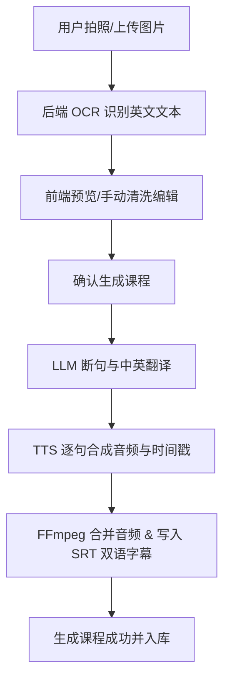
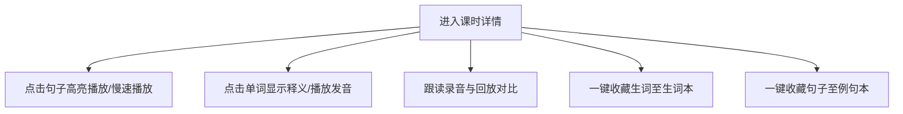

# SnapLesson / 一拍成课 PRD (Demo/推广测试版)

本项目是 **一拍成课 (SnapLesson)** 的 Demo 推广测试版本。旨在通过最轻量、最直观的链路，验证“**用户拍照 -> 形成英语课程**”的核心价值。
为快速上线并降低复杂度，本项目在技术架构和交互风格上完全参考 [englishPodStudy](file:///Users/luluen/ai-project/englishPodStudy)，作为其高度精炼的 Demo 衍生版。

---

## 1. 产品定位与核心价值

**一拍成课** 是一个面向小学生及英语初学者的 AI 课件生成与学习工具。
* **一句话功能**：用户拍摄纸质英语课本/资料，系统一键识别、清洗、生成高质量标准音频和双语字幕，秒级转化为可交互的“点读学习课程”。
* **Demo版目标**：不进行过度设计，只保留单兵闭环。普通用户注册后直接“白嫖”管理员配置好的 AI 模型与 TTS 语音合成，迅速体验产品核心流程，提升推广转化率。

---

## 2. 核心业务流程

### 2.1 拍照成课主流程


### 2.2 课程学习与复习流程


---

## 3. 功能范围与需求细化

为防止过度设计，本项目**严格砍掉**了以下复杂功能：
* ❌ 连读解析 (Liaison Analysis)
* ❌ 词块拆分 (Chunks)
* ❌ AI 口语对话 (AI Chat)
* ❌ 听写测试 (Dictation)
* ❌ 学习历史与打卡统计

### 3.1 鉴权与用户管理 (Auth & User Admin)
* **用户注册与登录**：支持用户名/密码进行注册与登录。
* **用户角色划分**：
  * **管理员 (Admin)**：具有最高权限。可进入管理后台；配置全局 AI 接口；查看、禁用/启用、删除普通用户。
  * **普通用户 (User)**：注册后即为普通用户。直接使用系统服务，不需要（且不可见）AI 模型配置界面。
* **管理员用户管控**：
  * 管理员可在列表中一键“禁用”或“启用”某用户，被禁用的用户将无法登录或调用 API。
  * 管理员可彻底“删除”普通用户，同时级联删除该用户的所有收藏数据。

### 3.2 共享 AI 模型配置 (Shared AI Models)
* **统一配置**：仅管理员可见“系统设置”页面，用于配置以下服务：
  * **LLM (大语言模型)**：Base URL, API Key, Model Name（用于断句及中文翻译）。
  * **OCR (光学字符识别)**：支持接入小米 MIMO (Vision 模型)、智谱 GLM-5V-Turbo 或云知声 OCR。
  * **TTS (语音合成)**：支持配置全局 TTS 引擎与默认发音人。
* **共享机制**：系统仅在数据库中维护管理员的一套 AI 密钥与配置。普通用户在使用 OCR、LLM 断句翻译和 TTS 合成时，后端自动调用管理员配置的参数进行请求，实现“免配置共享使用”。

### 3.3 拍照生成课时 (Photo to Lesson)
* **图片上传**：支持移动端直接调用相机拍照或从相册选择图片（支持裁剪和预览）。
* **OCR 文本识别**：后端接收 Base64 图片，调用配置的 OCR 引擎提取出英文文本。
* **文本清洗与人工微调**：
  * 识别出的文本显示在前端编辑框中。
  * 用户可以手动删改识别错误，清洗无关字符，并一键预览。
* **断句与翻译 (LLM)**：调用大模型将清洗后的英文文本分割成合理的句子数组，并为每一句生成精准的中文翻译：
  ```json
  [
    { "english": "Excuse me, where is the library?", "chinese": "请问图书馆在哪里？" }
  ]
  ```
* **音频合成与字幕生成 (TTS & SRT)**:
  * 后端调用 TTS 服务逐句合成 MP3 音频，并记录每句的音频时长（Duration）。
  * 根据每句时长自动累加计算出句子在整段课时中的 `start` 与 `end` 相对偏移时间戳。
  * 使用 **FFmpeg** 的 `concat` 协议将所有单句音频无缝合并为单个课时音频文件 `lesson.mp3`。
  * 自动写入 SRT Subtitle 文件（支持英文、中文、双语三种字幕格式）。
  * 将新课时与课程记录写入数据库，音频与字幕文件保存在本地存储。

### 3.4 课程学习页 (Lesson Player)
* **双语字幕对齐点读**：
  * 界面按句子卡片由上至下展示英文和中文翻译。
  * 音频播放时，当前播放句子自动高亮并滚动到可视区域中央。
  * 点击任意句子卡片，音频自动跳转（Seek）到该句起点开始播放。
* **语速调节**：支持正常速度与慢速（0.8x / 0.75x）播放。
* **跟读（Shadowing）对比**：
  * 每一句卡片右侧提供“录音”按钮。
  * 孩子可点击录音并大声跟读，松开/点击停止后保存本地音频缓存。
  * 支持单独播放标准原音、播放孩子录音，方便对比发音差异。
* **单词点读释义**：
  * 点击字幕中的任意单个英文单词，弹窗/悬浮条显示该单词的中文释义和音标。
  * 弹窗内提供喇叭按钮，点击即可播放该单词的独立 TTS 读音。
  * 单词释义优先通过本地轻量字典数据库查询，无结果则回退到免费在线词典接口。

### 3.5 个人收藏本 (Favorites)
* **生词本**：
  * 在单词点读弹窗中可一键收藏该生词（仅收藏纯单词，不含短语）。
  * 生词本页面按时间倒序展示收藏单词、音标与释义，支持一键播放单词读音 and 移出单词本。
* **例句本**：
  * 课时详情的每个句子卡片上提供收藏按钮，可将整句一键收藏。
  * 例句本页面展示收藏的英文例句、对应翻译及来源课时。支持点击例句播放该句的课时原音、支持例句移出。

---

## 4. 技术栈与架构设计 (完全对齐 englishPodStudy)

### 4.1 技术栈
* **前端 (Frontend)**:
  * **框架**：Vite + React 19 + TypeScript。
  * **路由**：React Router 7。
  * **样式**：Vanilla CSS + Tailwind CSS 4。
* **后端 (Backend)**:
  * **运行环境**：Node.js (版本 >= 22)。
  * **Web 框架**：不使用 Express/FastAPI 等大框架，直接采用 Node.js 原生 `node:http` 配合轻量自研路由（即 `routes/router.js` 模式）。
  * **数据库**：使用 Node.js 22 内置的原生 SQLite 驱动 `node:sqlite` (`DatabaseSync` 模块)。
  * **多媒体处理**：利用系统安装的 **FFmpeg** 命令行工具，通过 `child_process.spawnSync` 进行音频的格式转换与拼接。
* **数据目录 (Resources)**:
  * 项目根目录下创建 [resource/](file:///Users/luluen/ai-project/SnapLesson/resource) 文件夹，用于存放 SQLite 数据库文件 (`db.sqlite`) 和生成的音视频、字幕资源（按课时 ID 分文件夹隔离存储）。

### 4.2 数据库 Schema 规划

```sql
-- 1. 用户表
CREATE TABLE IF NOT EXISTS users (
  username TEXT PRIMARY KEY,
  salt TEXT NOT NULL,
  passwordHash TEXT NOT NULL,
  role TEXT NOT NULL,              -- 'admin' 或 'user'
  disabled INTEGER NOT NULL DEFAULT 0 -- 0 启用，1 禁用
);

-- 2. 会话表
CREATE TABLE IF NOT EXISTS sessions (
  token TEXT PRIMARY KEY,
  username TEXT NOT NULL,
  FOREIGN KEY (username) REFERENCES users(username) ON DELETE CASCADE
);

-- 3. 全局 AI 配置表 (仅管理员可读写，普通用户仅在后端共享其设置)
CREATE TABLE IF NOT EXISTS user_settings (
  username TEXT PRIMARY KEY,
  openai_base_url TEXT,
  openai_model TEXT,
  openai_api_key TEXT,
  tts_provider TEXT DEFAULT 'edge',  -- 'edge', 'mimo', 'unisound'
  tts_voice TEXT DEFAULT 'en-US-EmmaNeural',
  tts_base_url TEXT,
  tts_api_key TEXT,
  tts_model TEXT,
  ocr_provider TEXT DEFAULT 'mimo',  -- 'mimo', 'zhipu', 'unisound'
  ocr_base_url TEXT,
  ocr_api_key TEXT,
  ocr_model TEXT,
  FOREIGN KEY (username) REFERENCES users(username) ON DELETE CASCADE
);

-- 4. 课程表
CREATE TABLE IF NOT EXISTS courses (
  id TEXT PRIMARY KEY,
  name TEXT NOT NULL,
  type TEXT NOT NULL,               -- 'custom'
  createdAt INTEGER NOT NULL
);

-- 5. 课时表
CREATE TABLE IF NOT EXISTS lessons (
  id TEXT PRIMARY KEY,
  courseId TEXT NOT NULL,
  title TEXT NOT NULL,
  level TEXT NOT NULL,              -- '简单', '中等', '困难'
  audioFile TEXT NOT NULL,          -- 如 'lesson.mp3'
  subtitlesJson TEXT,               -- 存储双语字幕映射，如 {"en":"subtitle.srt","zh":"subtitle.zh.srt","bilingual":"subtitle.bilingual.srt"}
  createdAt INTEGER NOT NULL,
  FOREIGN KEY (courseId) REFERENCES courses(id) ON DELETE CASCADE
);

-- 6. 收藏单词表 (生词本)
CREATE TABLE IF NOT EXISTS vocab (
  username TEXT NOT NULL,
  id TEXT NOT NULL,                 -- 唯一标识 UUID
  word TEXT NOT NULL,
  phonetic TEXT,
  translation TEXT,
  createdAt INTEGER,
  PRIMARY KEY (username, id),
  FOREIGN KEY (username) REFERENCES users(username) ON DELETE CASCADE
);

-- 7. 收藏例句表 (例句本)
CREATE TABLE IF NOT EXISTS reviews (
  username TEXT NOT NULL,
  id TEXT NOT NULL,                 -- 唯一标识 UUID
  text TEXT NOT NULL,               -- 英文例句
  translation TEXT,                 -- 中文翻译
  lessonId TEXT,                    -- 来源课时 ID
  audioStart REAL,                  -- 音频起点偏移时间（秒）
  audioEnd REAL,                    -- 音频终点偏移时间（秒）
  createdAt INTEGER,
  PRIMARY KEY (username, id),
  FOREIGN KEY (username) REFERENCES users(username) ON DELETE CASCADE
);
```
```

### 4.3 PWA 与移动端优化规范

完全复刻 `englishPodStudy` 的移动端适配细节与 PWA 体验规范：

1. **PWA 配置与 Service Worker**：
   - 编写标准 [manifest.webmanifest](file:///Users/luluen/ai-project/SnapLesson/apps/web/public/manifest.webmanifest)，配置 `display: "standalone"`、`orientation: "any"`（支持横竖屏自适应）并指定主题颜色。
   - 实现 [sw.js](file:///Users/luluen/ai-project/SnapLesson/apps/web/public/sw.js)（Service Worker）文件。建立 `APP_CACHE` 和 `STATIC_CACHE` 版本控制（例如 `-v1`）。
   - 在 Service Worker 中实现静态资源的 **Cache-First**，对常规页面路由访问实现 **Network-First**（若断网冷启动，则降级返回缓存的 `/index.html` 以保证离线可用）。
   - 在 [main.tsx](file:///Users/luluen/ai-project/SnapLesson/apps/web/src/main.tsx) 中实现条件注册，仅在生产环境或特定部署域名下加载 `sw.js`。

2. **下拉刷新误触阻止 (Pull-to-Refresh)**：
   - 在全局 CSS (`index.css`) 中，对 `html, body` 统一配置 `overscroll-behavior-y: contain`，阻止移动端浏览器外壳下拉引发的强制刷新，防止中断学习音频。

3. **双布局后台管理 (Admin Responsive Layout)**：
   - 管理员用户管理页面必须实现移动端自适应：宽屏时渲染标准表格展示，在手机等窄屏（`md` 以下）下隐藏表格，自动转换为 **Card Stack (卡片列表流)** 结构，并确保所有操作按钮均符合大于 `44x44px` 的触控热区标准。

4. **单句高精度播放与循环防漏音 (Precision Audio Loop)**：
   - 避免直接依赖触发频率极低的默认 `timeupdate`（`150ms-250ms` 间隔），这会导致逐句播放/跟读在跳转切句时预读下一句句首。
   - 在前端播放器中引入高频 `requestAnimationFrame` (rAF) 循环监听，设置 `30ms` 的**安全截断余量 (Safety Margin)**。在进度到达当前句子终点前 `30ms` 强制触发暂停或重播，防止音频出血。

5. **本地录音防御与内网开发指引 (Recording Constraints)**：
   - 调用 `navigator.mediaDevices.getUserMedia` 前进行防御性判断。若用户未在 HTTPS 环境或 localhost 下使用（例如局域网 IP `192.168.x.x` 导致录音 API 被浏览器隐藏），则不抛出异常崩溃，而是弹窗向用户显示明确的指引，引导其通过 `chrome://flags/#unsafely-treat-insecure-origin-as-secure` 信任内网测试地址。

6. **长效状态与进度持久化 (State Preservation)**：
   - 用户的登录 Token 与当前点读的课时进度（包括最后播放的句子索引、播放时间）实时写入 `localStorage`。当应用后台切回重新冷启动时，能够恢复上次学习状态。

---

## 5. 开发里程碑与优先级 (V0.1 Demo)

根据非过度设计与移动端 PWA 优先原则，首版 Demo 开发划分为三大核心步骤：

* **阶段 1：底座搭建、鉴权与 PWA 基础 (P0)**
  * 初始化 Monorepo 目录结构（`apps/api` 与 `apps/web`）。
  * 迁移并简化 `englishPodStudy` 的底层 HTTP 服务与 SQLite 连接逻辑，创建初始数据库及管理员/用户表结构。
  * 实现登录、注册功能，以及管理员的用户管理页（窄屏卡片自适应）。
  * 实现管理员的全局 AI 模型参数配置接口（OCR, TTS, LLM）。
  * 编写 `manifest.webmanifest` 与 `sw.js`，在 [main.tsx](file:///Users/luluen/ai-project/SnapLesson/apps/web/src/main.tsx) 中建立 PWA 缓存机制与 `overscroll-behavior-y` 配置。

* **阶段 2：拍照生成课时核心链路 (P0)**
  * 图片上传与 Base64 压缩。
  * 后端对接配置好的 OCR 服务，提供识别接口。
  * 前端开发图片剪裁、OCR 识别预览与文本人工编辑清洗页面。
  * 开发课程生成后端 API：通过 LLM 断句翻译、TTS 逐句生成 MP3 音频分片、FFmpeg 合并音频及写入双语 SRT。

* **阶段 3：播放、跟读与收藏复习 (P0)**
  * 课时列表展示。
  * 开发课时学习页面：实现逐句点读高亮滚动、高频 rAF 时序高精度循环（带 30ms 安全截断防漏音）、慢速播放、本地录音与播放对比。
  * 点击单词触发本地词典释义弹框与单词发音。
  * 实现生词本、例句本的收藏与展示列表。

